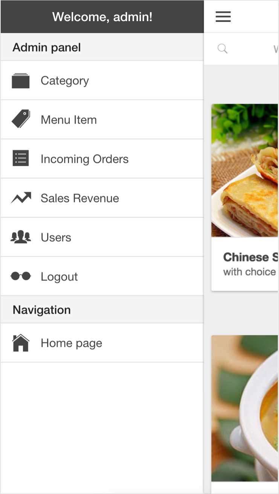
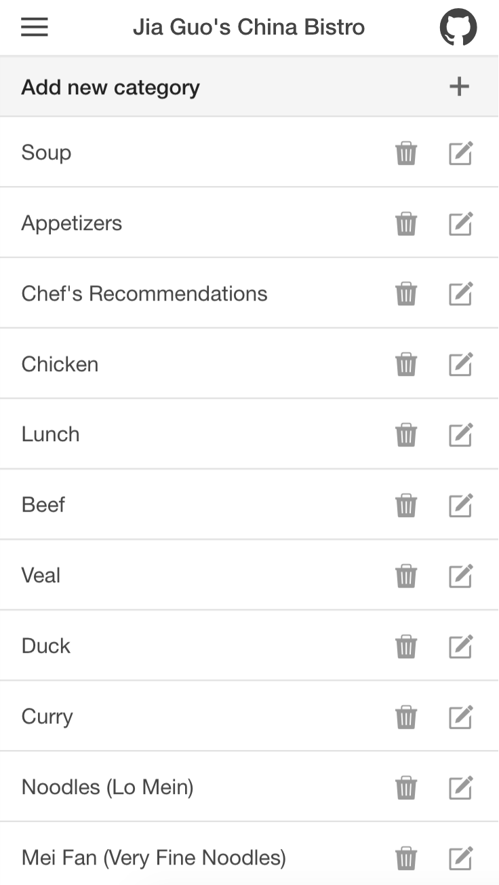
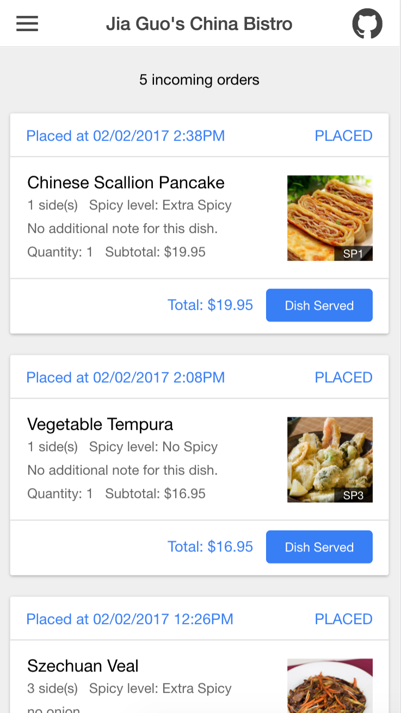

# menuApp

For a quick view, check out: <a href="http://jiamenu.herokuapp.com">http://jiamenu.herokuapp.com</a>

<h3>About this App</h3>

A full-fledged, ready-to-use restaurant mobile app, made from scratch by <b>Jia Guo</b> as a learning project.

To get the best using experience, please use <b>Chrome</b> on your mobile phone.

<b>Frontend:</b>Crafted with <b>AngularJS</b> and <b>Ionic</b>, it can be easily deployed as a functional <b>ios or android app</b>.

<b>Backend:</b>Homemade RESTful API powered by <b>Node.js</b>, <b>Expressjs</b>, <b>Mongodb</b>, and <b>Mongoose</b>.

<h3>User stories</h3>
<h4>As a diner, I can...</h4>
<ul>
    <li>browse menu by category;</li>
    <li>search for dishes using keywords;</li>
    <li>create an account or login to my account;</li>
    <li>add dishes to my cart;</li>
    <li>view and edit items in my cart;</li>
    <li>place orders and view my previous orders.</li>
</ul>
<h4>As the restaurant owner, I can...</h4>
<ul>
    <li>create, update, and delete a menu category;</li>
    <li>create, update, and delete a menu item;</li>
    <li>view incoming orders and update order status;</li>
    <li>view the sales revenue of my restaurant;</li>
    <li>identify active customers by their purchases.</li>
</ul>

<h3>Admin control panel</h3>

A fully functional control panel for restaurant owner.

<h3>Jasmine test suite</h3>

60 tests on Angular services and controllers.
